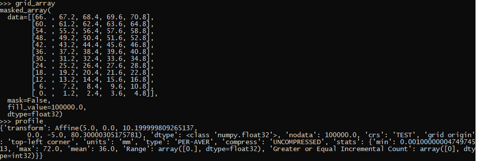
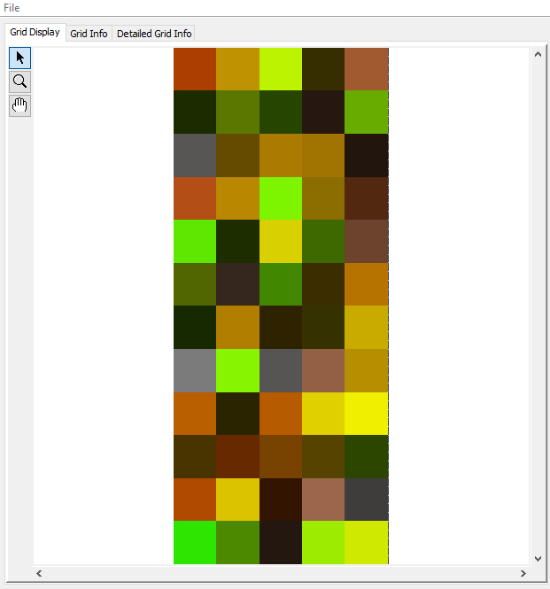
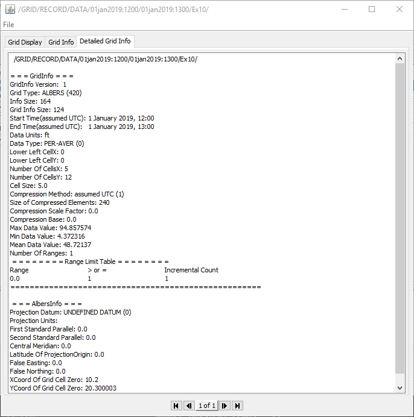

About pydsstools
===

pydsstools is an experimental Cython based Python library to manipulate [HEC-DSS](http://www.hec.usace.army.mil/software/hec-dssvue/) database file. It supports regular/irregular time-series, paired data series and spatial grid records (partially). Currently, this library works only with  Python 3.7+ 64-bit on Windows machine.

Changes
===

[**changelog**][changelog]

   [changelog]: https://github.com/gyanz/pydsstools/blob/master/CHANGES.MD

Usage
===

Sample dss file available in examples folder.

### Example 1
Read and plot regular time-series data 

```
from datetime import datetime
from pydsstools.heclib.dss import HecDss
import matplotlib.pyplot as plt
from matplotlib import dates
import numpy as np

dss_file = "example.dss"

pathname = "/REGULAR/TIMESERIES/FLOW//1DAY/READ/"
startDay = "10MAR2006"
startTime ="24:00"
endDay = "09APR2006"
endTime = "24:00"

with HecDss.Open(dss_file) as fid:
    tsc = fid.read_window(pathname,startDay,startTime,endDay,endTime)
    # or tsc = fid.read_path(pathname)
    times = tsc.pytimes
    values = tsc.values
    print("times = {}".format(times))
    print("values = {}".format(values))

    plt.plot(times,values,"o")
    plt.ylabel(tsc.units)
    plt.gca().xaxis.set_major_locator(dates.DayLocator())
    plt.gca().xaxis.set_major_formatter(dates.DateFormatter("%d%b%Y"))
    plt.show()
```

### Example 2
Write regular time-series data
```
import numpy as np
from datetime import datetime
from pydsstools.heclib.dss import HecDss
from pydsstools.core import TimeSeriesContainer

dss_file = "example.dss"

tsc = TimeSeriesContainer()
tsc.granularity_value = 60 #seconds i.e. minute granularity
tsc.numberValues = 10
tsc.startDateTime=datetime.now().strftime('%d %b %Y %H:00')
tsc.pathname = "/REGULAR/TIMESERIES/FLOW//1HOUR/WRITE2/"
tsc.units = "cfs"
tsc.type = "INST"
tsc.interval = 1
#must a +ve integer for regular time-series
#actual interval implied from E part of pathname
tsc.values =np.array(range(10),dtype=np.float32)
#values may be list,array, numpy array

fid = HecDss.Open(dss_file)
fid.deletePathname(tsc.pathname)
status = fid.put(tsc)
fid.close()
```

### Example 3
Write irregular time-series data
```
from datetime import datetime,timedelta
from array import array
from random import randrange
from pydsstools.heclib.util import HecTime
from pydsstools.heclib.dss import HecDss
from pydsstools.core import TimeSeriesContainer

dss_file = "example.dss"

tsc = TimeSeriesContainer()
tsc.granularity_value = 60 #second i.e. minute granularity
tsc.numberValues = 10
tsc.pathname = "/IRREGULAR/TIMESERIES///IR-CENTURY/WRITE/"
#IR-MONTH, IR-YEAR, IR-DECADE, IR-CENTURY
tsc.units ="cfs"
tsc.type = "INST"
tsc.interval = -1
#-1 for specifying irregular time-series
tsc.values = array("d",range(10))
#values may be list, python array, or numpy array

times = []
begin = datetime(1899,12,31)
end = datetime(2017,4,18)
for x in range(tsc.numberValues):
    diff = end - begin
    diff_seconds = diff.days*24*60*60 +diff.seconds
    _rand= randrange(diff_seconds)
    new_date = begin+timedelta(seconds=_rand)
    hec_datetime = HecTime(new_date.strftime("%d %b %Y %H:%M"))
    #default granularity is minute
    times.append(hec_datetime.datetimeValue)

times = sorted(times)
#time must be in ascending order in irregular tsc

tsc.times = times

with HecDss.Open(dss_file) as fid:
    status = fid.put(tsc)
```

### Example 4
Read paired data
```
from datetime import datetime
from pydsstools.heclib.dss import HecDss

dss_file = "example.dss"
pathname ="/PAIRED/DATA/STAGE-FLOW///READ/"

fid = HecDss.Open(dss_file)
# read paired data as pandas dataframe
df = fid.read_pd(pathname)
print(df)
fid.close()
```

### Example 5 
Write paired data series
```
from array import array
import numpy as np
from pydsstools.heclib.dss import HecDss
from pydsstools.core import PairedDataContainer

dss_file = "example.dss"
pathname ="/PAIRED/DATA/FREQ-FLOW///WRITE/"

fid = HecDss.Open(dss_file)
pdc = PairedDataContainer()

pdc.pathname = pathname
pdc.curve_no = 1
pdc.independent_axis = array('f',[i/10.0 for i in range(1,10)])
pdc.data_no = len(pdc.independent_axis)
pdc.curves = np.array([range(1,10)],dtype=np.float32)
fid.put_pd(pdc)
fid.close()
``` 

### Example 6 
Pre-allocate paired data-series table
```
from array import array
from pydsstools.heclib.dss import HecDss
from pydsstools.core import PairedDataContainer

dss_file = "example.dss"
pathname ="/PAIRED/DATA/FREQ-FLOW///PREALLOC WRITE/"
max_column_label_len = 5

pdc = PairedDataContainer()
pdc.pathname = pathname
pdc.curve_no = 10
pdc.independent_axis = array('f',[i/10.0 for i in range(1,11)])
pdc.data_no = len(pdc.independent_axis)
pdc.labels_list=[chr(x) for x in range(65,65+10)]

fid = HecDss.Open(dss_file)
fid.prealloc_pd(pdc,max_column_label_len)
fid.close()
```

### Example 7 
Read pathname catalog
```
from pydsstools.heclib.dss.HecDss import Open

dss_file = "example.dss"

pathname_pattern ="/PAIRED/*/*/*/*/*/"

with Open(dss_file) as fid:
    path_list = fid.getPathnameList(pathname_pattern,sort=1)
    print('list = %r' % path_list)
```

### Example 8 
Delete dss record 
```
from pydsstools.heclib.dss.HecDss import Open

dss_file = "example.dss"

pathname ="/PAIRED/DATA/STAGE-FLOW///DELETE/"

with Open(dss_file) as fid:
    status = fid.deletePathname(pathname)
    print('return status = %d' % status)
```

### Example 9 
Read Spatial Grid 
```
from pydsstools.heclib.dss.HecDss import Open

dss_file = "spatialgrid0.dss"

pathname = "/a/b/c/01jan2001:1200/01jan2001:1300/f/"

with Open(dss_file) as fid:
    dataset = fid.read_grid(pathname)
    dataset.read()
    dataset.profile
```


### Example 10 
Write Spatial Grid record 
```
import numpy as np
from pydsstools.heclib.dss.HecDss import Open

dss_file = "spatialgrid0.dss"

pathname_in = "/a/b/c/01jan2001:1200/01jan2001:1300/f/"
pathname_out = "/a/b/c/01jan2001:1200/01jan2001:1300/write/"

with Open(dss_file) as fid:
    # get shape and profile from example grid dss record
    dataset_in = fid.read_grid(pathname_in)
    profile_in = dataset_in.profile
    grid_in = dataset_in.read()

    # create random array, update profile and save as grid record
    profile_out = profile_in.copy()
    profile_out.update(type="PER-AVER",nodata=0,transform=dataset_in.transform) # required parameters
    profile_out.update(crs="UNDEFINED",units="ft",tzid="",tzoffset=0,datasource='') # optional parameters
    grid_out = np.random.rand(*grid_in.shape)*100
    fid.put_grid(pathname_out,grid_out,profile_out,flipud=1)

    # NOTES:
    #   type options: PER-AVER, PER-CUM, INST-VAL,INST-CUM, FREQ, INVALID
    #   flipud: 1 (default) -  flips the numpy array upside down as dss array layout is opposite
    #           0 - numpy array array is stored as is
```



API
===
* pydsstools.heclib.dss.HecDss
  * Open(**kwargs) Class
    * read_pd_df(pathname,dtype,copy)
    * read_pd (alias for read_pd_df)
    * getPathnameList(pathname,sort)
    * deletePathname(pathname)
    * members inherited from core.Open class
* pydsstools.core
  * Time-Series
    * TimeSeriesStruct 
      (Object returned when time-series data is read)
      * numberValues
      * times
      * values
      * type
      * units
      * pathname
      * granularity       
      * startDate
      * endDate
      * dtype
    * TimeSeriesContainer(**kwargs) 
      (Container used to store time-series data before writing to file)
      * pathname
      * interval
      * granularity_value
      * numberValues
      * times
      * startDateTime
      * units
      * type
      * values
      * values (setter)
  * Paired Data Series
    * PairedDataStruct 
      (Object returned when paired data series is read)
      * curve_no()
      * data_no()
      * get_data() 
        (Returns tuple  consisting of ordinates,curves and labels)
        * labels
        * dataType
    * PairedDataContainer 
      (Container used to store paired data series before writing to file)
      * pathname
      * curve_no
      * data_no
      * curve_mv 
        (2-D numpy array object with each row representing a curve of length data_no. The total number of rows must be equal to curve_no.)
      * independent_units 
        (feet, ...)
      * independent_type 
        (linear, ...)
      * dependent_units 
        (feet, ...)
      * independent_axis 
        (1-D python or numpy array containing independent axis values whose length must be equal to data_no.)
      * dependent_type
      * labels_list
      * curves
  * Spatial Grid
    * SpatialGridStruct
		* read() - returns (cached) numpy array with grid origin at upper left corner
		* xy(row,col,offset='center') - returns x,y coordinate of z pixel at row and col (same as rasterio)
		* index (x,y,op=math.floor,precision=None) - returns row,col for pixel containing x,y coordinate (same as rasterio)
		* crs - coordinate reference system string
		* dtype - numpy array data type which is np.float32
		* nodata
		* bounds - gives extent of the grid
		* units - unit of array data
		* transform - affine transform matrix of form (dx, 0, xmin, 0, -dy, ymax)
		* profile - dictionary of various attributes
    * SpatialGridContainer 
    * get_grid_version(Open fid,pathname)
  * Open(**kwargs) Class
    * read_path(pathname)
    * read_window(pathname,startDate,startTime,endDate,endTime)
    * put(TimeSeriesContainer tsc, storageFlag=0)  
    * copyRecordsFrom(Open copyFrom, pathnameFrom, pathnameTo="")
    * copyRecordsTo(Open copyTo, pathnameFrom, pathnameTo="")
    * read_pd(pathname)
    * prealloc_pd(PairedDataContainer pdc, label_size)
    * put_one_pd(PairedDataContainer pdc, curve_no)
    * put_pd(PairedDataContainer pdc)
    * read_grid(pathname)
    * put_grid(pathname,grid_array,profile_dict,flipud=1)
  * HecTime(datetimeString,granularity_value=60) Class
    * granularity_value
    * datetimeValue
    * python_datetime 
    * formatDate(format = "%d%b%Y %H:%M")
    * dateString()
    * timeString()
    * addTime(**kwargs)
    * clone()
    * following staticmethods ...
    * parse_datetime_string(datetimeString,granularity_value=60)
    * getDateTimeStringTuple(dateValue,granularity_value=60)
    * getPyDateTimeFromString(dateString)
    * getPyDateTimeFromValue(dateValue,granularity_value=60)
    * getDateTimeValueTuple(dateValue,granularity_value=60)

Dependencies
===

- [NumPy](https://www.numpy.org)
- pandas
- affine

Installation
===
```
python setup.py install 

or

pip install https://github.com/gyanz/pydsstools/zipball/master  
```

Contributing
===
All contributions, bug reports, bug fixes, documentation improvements, enhancements and ideas are welcome.
Feel free to ask questions on my [email](mailto:gyanBasyalz@gmail.com).


License
===
This program is a free software: you can modify and/or redistribute it under [MIT](LICENSE) license. 
